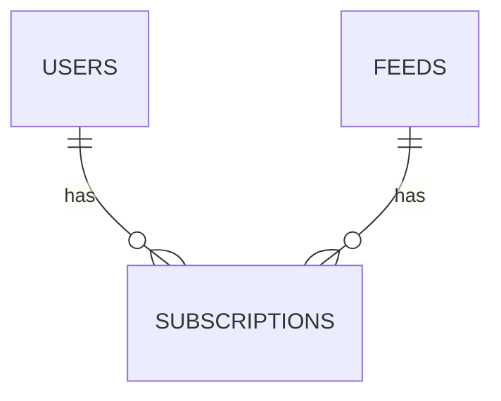

import CoreEndpoint from "@partials/_core-endpoint.md";

<CoreEndpoint />

The `subscriptions` endpoint is used to synchronize subscriptions between a server and connected clients.

## What is a subscription?

Subscriptions represent the relationship between **users** and **podcast feeds**.
Each user may have many subscriptions, and each feed may have many subscribers.

Users may add and delete subscriptions at any time.
Deleting a subscription **MUST NOT** result in the feed being removed.

## `guid` calculation

Subscriptions are identified by a globally unique `guid` value.
This `guid` is used as the `id` field of each subscription resource and acts as the canonical resource identifier.

Feed `guid` values **MUST** be created in accordance with the [Podcast Index's methodology](https://github.com/Podcastindex-org/podcast-namespace/blob/main/docs/tags/guid.md).
If a feed already has a valid UUIDv5 `guid` tag, the client **MUST** pass this value to the server when submitting the feed.
If the feed doesn't have a valid `guid` tag, the client **MUST**:

1. Generate a UUIDv5 `guid` value using:
   - The feed URL (with protocol and trailing slashes removed).
   - The Podcast namespace UUID: `ead4c236-bf58-58c6-a2c6-a6b28d128cb6`.
2. Pass the generated value as the `guid` in the API request.

This process ensures that any feed not currently registered with the Podcast Index is identified by the exact same GUID it would receive if it were updated to the Podcasting 2.0 specification.

The server **MUST** reject invalid `guid` values with a `400 Bad Request` response.

The server **MUST NOT** attempt to validate or recalculate the `guid` against the `feedUrl`, as the origin URL may have changed since the `guid` was set.

## Supported actions

- [Add a subscription](/specs/subscriptions/add-subscription)
- [List all subscriptions](/specs/subscriptions/list-subscriptions)
- [Get a subscription](/specs/subscriptions/get-subscription)
- [Delete a subscription](/specs/subscriptions/delete-subscription)
